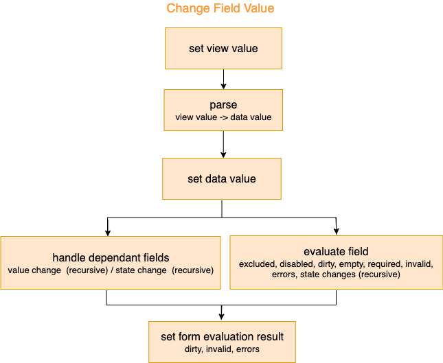

Form actions (api functions) allows interaction and manipulation of the form model object and the model's data in particular. 
The following actions are the exposed api and their example of usage:

## init

Init the form instance with a model & resources objects. Form can't be used before calling init.

```
await myForm.init(model, resources, settings);
```

#### Args

| Name          | Type          | Description |
| ------------- |-------------| ------------|
| model | required object | [Model](arguments#model) definition object. represent the current form state |
| resources | object | [Resources](arguments#resources) of the model that will be in used by the form class |
| settings | object | [Settings](arguments#settings) overrides that will be in used by the form class |

#### Lifecycle

1. [Transpile](definition-shorthand) form definition
1. Verify form definition
1. Init form with `model`, `resources` as `settings` as described in [init form](actions#init-form)

#### Example

```javascript
import Form from '@jafar/form';

// define user form
const model = {
  id: 'user-form',
  fields: {
    firstName: {
      path: 'firstName',
      validators: [{
        name: 'uniqueName'
      }],
    },
    lastName: {
      path: 'lastName',
    }
  },
  data: {
    firstName: 'Ross',
    lastName: 'Geller',
  }
};

const resources = {
  validators: {
    uniqueName: () => {
      // ...
    },
  }
};

// create user form
const form = new Form();
await form.init(model);

// verify initial data
expect(form.data).toEqual({ firstName: 'Ross', lastName: 'Geller' });
```

## changeValue

Change a field's value to a new value. New value will be placed in the form's data object according to the field's path.

```
await myForm.changeValue('firstName', 'Monica');
```

#### Args

| Name          | Type          | Description |
| ------------- |-------------| ------------|
| fieldId | required string | Field id to apply the change on |
| value | any / function | New value or an updater function which returns a new value |

> **Note:** `updater function` is only supported when field defines a component (meant for rare UI cases). 


#### Lifecycle

1. If field component is defined - set the value to the form as the vew value (i.e field.component.value).
2. If field parser is defined - parse the value to data value. Otherwise value is data value.
3. If data value considered to be empty (using [isEmpty](hooks.html#isempty) function) - unset it from the form's data, otherwise - set the data value to the form's data object (i.e model.data).
4. Evaluate field and dependencies - as described in [evaluate field and dependencies](actions#evaluate-field-and-dependencies).
5. Set form evaluation result - as described in [set form evaluate result](actions#set-form-evaluation-result).

##### high level demonstration 



#### Example - value is any

```javascript
import Form from '@jafar/form';

// define destination form
const model = {
  id: 'destination',
  fields: {
    country: {
      path: 'country',
    }
    city: {
      path: 'city',
      dependencies: ['country'], 
      disableTerm: { // city is disabled if country equals Spain
        name: 'equals',
        args: {
          fieldId: 'country',
          value: 'Spain',
        }
      },
    },
  },
  data: {
    country: 'Israel',
  }
};

// create destination form
const form = new Form();
await form.init(model);

// verify initial data
expect(form.data).toEqual({ country: 'Israel' });
expect(form.fields.city.disabled).toBeFalsy();

// change field country value
const newValue = 'Spain';
await form.changeValue('country', newValue);

// verify form after the change
expect(form.data.country).toEqual(newValue);
expect(form.fields.city.disabled).toBeTruthy();
```

#### Example - value is an updater function

When updating field's value from multiple places at the same time, based on a specific point in time store value - one place can override other place's value changes (for example if a field is using a component that uses some underline components and each underline
component is calling change value on init).
Using - updater function, one can return an updated value object based on the current value (view value) that exists in Jafar's store.

```javascript
import Dimensions from './my-components/Dimensions';
import Form from '@jafar/form';

// define user form
const model = {
  id: 'user-form',
  fields: {
    size: {
      path: 'size',
      component: {
        name: 'Dimensions',
      },
    },
  },
  data: {
    size: { x: 1, y: 1 },
  }
};

const resources = {
  components: {
    Dimensions: { renderer: Dimensions },
  },
};

// create user form
const form = new Form();
await form.init(model, resources);

// change size field value - mock change from multiple places
const promise1 = form.changeValue('size', ({ value }) => ({ x: value.x + 1, y: value.y + 1 }));
const promise2 = form.changeValue('size', ({ value }) => ({ x: value.x + 1, y: value.y + 1 }));

await Promise.all([promise1, promise2]);

// verify form after the change
expect(form.fields.size.component.value).toEqual({ x: 3, y: 3 }); // view value
expect(form.data.size).toEqual({ x: 3, y: 3 }); // data value
```

## changeData

Change form's data object to a new object.

```
await myForm.changeData({ firstName: 'Janice', lastName: 'Litman-Goralnik' });
```

| Name          | Type          | Description |
| ------------- |-------------| ------------|
| data | required object | New data object |

#### Lifecycle

1. Run [toDto](hooks#todto) hook, and set new data result to the form's store in `model.data`.
1. Evaluate form - as described in [evaluate form](actions#evaluate-form).

#### Example

```javascript
import Form from '@jafar/form';

// define user form
const model = {
  id: 'user-form',
  fields: {
    firstName: {
      path: 'firstName',
      required: true,
    },
    lastName: {
      path: 'lastName',
    }
  },
  data: {
    firstName: 'Ross',
    lastName: 'Geller',
  }
};

// create user form
const form = new Form();
await form.init(model);

// verify initial data
expect(form.data).toEqual({ firstName: 'Ross', lastName: 'Geller' });

// change data
const newData = { lastName: 'Green' };
form.changeData(newData);

// verify form after the change
expect(form.data).toEqual(newData);
expect(form.invalid).toBeTruthy();
expect(form.fields.firstName.errors).toEqual([{
  name: 'required',
  message: 'Field required',
}]]);
```

## changeState

Change a field's state object to a new object.

```
await myForm.changeState('hobbies', { 
  isLoadingItems: false, 
  searchValue: 'ball',
  items: [
    { label: 'Basketball', value: 'BASKETBALL' },
    { label: 'Football', value: 'FOOTBALL' },
  ] 
});
```

#### Args

| Name          | Type          | Description |
| ------------- |-------------| ------------|
| fieldId | required string | Field id to apply the change on |
| state | object / function | New component state object, or an updater function which returns a new component state object |

#### Lifecycle

1. Set the state of the field's component in the store
2. If `stateChange` function is defined - run it and if a value(sync/async) returns, then:
  - Set new state to `component.state`.
  - Call `changeState` with the new state
(if no value is returned from `stateChange` function - action complete)

> **Note:** `stateChange` can create recursive set states, so make sure you always define an exit case that returns an undefined value.


#### Example - state is an object

```javascript
import InputDate from './my-components/InputDate';
import Form from '@jafar/form';

// define user form
const model = {
  id: 'user-form',
  fields: {
    birthDate: {
      path: 'birthDate',
      component: {
        name: 'InputDate',
        state: {
          format: 'mm/dd/yyyy',
        },
      },
    },
  },
};

const resources = {
  components: {
    InputDate: { renderer: InputDate },
  },
};

// create user form
const form = new Form();
await form.init(model, resources);

// change birthDate field state
const newState = { format: 'MMMM dd, yyyy' };
await form.changeState('birthDate', newState);

// verify form after the change
expect(form.fields.birthDate.component.state).toEqual(newState);
```

#### Example - state is an updater function

When updating field's state object from multiple places at the same time, based on a specific point in time store state object - one place can override other place's state changes (for example if a field is using a component that uses some underline components and each underline
component is calling change state on init).
Using - updater function, one can return an updated state object based on the current state that exists in Jafar's store.

```javascript
import Dimensions from './my-components/Dimensions';
import Form from '@jafar/form';

// define user form
const model = {
  id: 'user-form',
  fields: {
    size: {
      path: 'size',
      component: {
        name: 'Dimensions',
        state: {
          x: 1,
          y: 1,
        },
      },
    },
  },
};

const resources = {
  components: {
    Dimensions: { renderer: Dimensions },
  },
};

// create user form
const form = new Form();
await form.init(model, resources);

// change size field state - mock change from multiple places
const promise1 = form.changeState('size', ({ state }) => ({ x: state.x + 1, y: state.y + 1 }));
const promise2 = form.changeState('size', ({ state }) => ({ x: state.x + 1, y: state.y + 1 }));

await Promise.all([promise1, promise2]);

// verify form after the change
expect(form.fields.size.component.state).toEqual({ x: 3, y: 3 });
```

## changeUi

Change a field's ui definitions.

```
const ui = { 
  component: { name: 'InputNumber' }, 
  description: 'Item count',
}
await myForm.changeUi('hobbies', ui);
```

#### Args

 Name          | Type          | Description |
| ------------- |-------------| ------------|
| fieldId | required string | Field id to apply the change on |
| ui | object | [Ui object](actions#ui-object) to be assigned to the field |

##### ui object

 Name          | Type          | Description |
| ------------- |-------------| ------------|
| label | string | New label string to be placed instead of current field's label |
| description | string | New description string to be placed instead of current field's description |
| component | object | New [component](component) object to be placed instead of current field's component |
| formatter | object | New [formatter](formatter-parser) object to be placed instead of current field's formatter |
| parser | object | New [parser](formatter-parser) object to be placed instead of current field's parser |


#### Lifecycle

1. Verify form definition
2. Replace field's ui definitions in the form
3. If component formatter is defined - format the value of the field as view value, otherwise current data value is the view value. 
4. Set view value as the value of the component.
5. If component stateChange defined - Run state change as specified on the second step of `changeState` function.

> **Note:** When changing ui and including a new `component`, `parser` or `formatter`, their resources must be pre-defined in the initial resources object passed to the Form on init - since resources object is not persistent, and passing new resources might damage form persistency.
> For example:
> 1. A form model is begin persisted after each action (saved to the local storage). 
> 2. A change ui is called with new ui and formatter resources that are being replaced in the form. 
> 3. After a while a refresh is done to the page. 
> 4. On page load - the form model is taken from the local storage (containing the definitions for new component and formatter) to return to the last form state, and the original resource object is being used with it to init the form. 
> 5. A missing component / formatter resource error is thrown.

#### Example

```javascript
import InputDate from './my-components/InputDate';
import DatePicker from './my-components/DatePicker';
import Form from '@jafar/form';

// define user form
const model = {
  id: 'user-form',
  fields: {
    birthDate: {
      path: 'birthDate',
      component: {
        name: 'InputDate',
        state: {
          format: 'mm/dd/yyyy',
        },
      },
    },
  },
};

const resources = {
  components: {
    InputDate: { renderer: InputDate },
    DatePicker: { renderer: DatePicker }, // new component resource should be set in the initial resources
  },
};

// create user form
const form = new Form();
await form.init(model, resources);

// change birthDate field component
const component = {
  name: 'DatePicker',
  state: {
    format: 'mm/dd/yyyy',
  },
};

form.changeUi('birthDate', { component });
```

## changeContext

Change form's context object to a new object.

```
await myForm.changeContext({ userId: '123', companyId: '456' });
```

| Name          | Type          | Description |
| ------------- |-------------| ------------|
| context | required object | New context object |

#### Lifecycle

1. Replace the context object in `model.context`.
2. Evaluate form - as described in [evaluate form](actions#evaluate-form).

#### Example

```javascript
import Form from '@jafar/form';

// define order form
const model = {
  id: 'order-form',
  fields: {
    // ...
    refundMoney: {
      path: 'refundMoney',
      component: { name: 'InputNumber' },
      context: ['loggedInUser'],
      excludeTerm: {  // field excluded to users that don't have refund permission
        not: true,
        name: 'hasPermission',
        args: { permission: 'REFUND_USER' }
      }
    } 
  },
  context: {
    loggedInUser: { id: '123', permissions: ['EDIT', 'REFUND_USER'] }
  },
  // ...
};

const resources = {
  terms: {
    hasPermission: {
      func: ({ context, args }) => context.loggedInUser.permissions.includes(args.permission),
    }
  }
};

// create user form
const form = new Form();
await form.init(model, resources);

// verify initial status
expect(form.context).toEqual({
  loggedInUser: { id: '123', permissions: ['EDIT', 'REFUND_USER'] }
});
expect(form.fields.refundMoney.excluded).toBeFalsy();

// change context
const newContext = { 
  loggedInUser: { id: '456', permissions: ['READ'] }
};
form.changeContext(newContext);

// verify form after the change
expect(form.context).toEqual(newContext);
expect(form.fields.refundMoney.excluded).toBeTruthy();
```

## submit

Submit the form using the form's model.data. Resolves to `true` on success.

```
const success = await myForm.submit();
```

#### Args

Function has no args.

#### Lifecycle

1. If form is invalid - throw invalid submit error.
1. Run form level [validation hook](hooks#validate) with the form's data.
1. If return errors object 
    - update fields and form errors and invalid flags.
    - return
1. Run [fromDto](hooks#fromdto) hook, and keep result as appData.
1. Run [submit hook](hooks#submit) with the appData.
1. Return true

#### Example

```javascript
import MyService from './MyService';
import Form from '@jafar/form';

// define user form
const model = {
  id: 'user-form',
  fields: {
    firstName: {
      path: 'firstName',
    },
    lastName: {
      path: 'lastName',
    }
  },
  data: {
    id: '123456',
    firstName: 'Ross',
    lastName: 'Geller',
  },
};

const resources = {
  hooks: {
    submit: async (data) => {
      // save to server
      await MyService.update(data);
    }
  }
};

// create user form
const form = new Form();
await form.init(model, resources);

// verify initial data
expect(form.data).toEqual({ id: '123456': firstName: 'Ross', lastName: 'Geller' });

// change field first name
await form.changeValue('firstName', 'Monica');

// submit the form
const success = await form.submit();

// verify submit
expect(success).toEqual(true);
const updatedUser = await MyService.fetchById('123456');
expect(updatedUser).toEqual({ id: '123456', firstName: 'Monica', lastName: 'Geller' });

// clear the form
if (success) {
  form.changeData({});
}
```

## destroy

Destroys the form. After destroy the form instance cant be used again, unless init is called again.

```
await myForm.destroy();
```

#### Args

Function has no args.

#### Lifecycle

Delete internal form definition (model & resources).

#### Example

```javascript
import Form from '@jafar/form';

// define user form
const model = {
  id: 'user-form',
  fields: {
    firstName: {
      path: 'firstName',
    },
    lastName: {
      path: 'lastName',
    }
  },
  data: {
    firstName: 'Ross',
    lastName: 'Geller',
  }
};

// create user form
const form = new Form();
await form.init(model);

// verify initial data
expect(form.data).toEqual({ firstName: 'Ross', lastName: 'Geller' });

// destroy the form
await form.destroy();
```

## reset

Init the form using the form's initial model and resources definitions.

```
await myForm.reset();
```

#### Args

Function has no args.

#### Lifecycle

1. Init form with initial `model` and `resources` as described in [init form](actions#init-form)

#### Example

```javascript
import MyService from './MyService';
import Form from '@jafar/form';

// define user form
const model = {
  id: 'user-form',
  fields: {
    firstName: {
      path: 'firstName',
    },
    lastName: {
      path: 'lastName',
    }
  },
  data: {
    firstName: 'Ross',
    lastName: 'Geller',
  },
};

// create user form
const form = new Form();
await form.init(model);

// verify initialized data
expect(form.data).toEqual({ firstName: 'Ross', lastName: 'Geller' });

// change field first name
await form.changeValue('firstName', 'Monica');

// verify changed data
expect(form.data).toEqual({ firstName: 'Monica', lastName: 'Geller' });

// reset the form
await form.reset();

// verify data back to its initialized data.
expect(form.data).toEqual({ firstName: 'Ross', lastName: 'Geller' });
```

## Common Logic

#### Init form

1. Set `model`, `resources` and `settings` to the form's store.
1. If `model` is persist model (checks if `model.initializedData` defined) - return.
1. Run [toDto](hooks#todto) hook, and set new data result to the form's store.
1. Evaluate form - as described in [evaluate form](actions#evaluate-form).
1. Set initialized data to the form.


#### Evaluate Form

- Format all fields to their view value and set to the store as the component value (if field formatter was not defined - view value is the data value).
- For Each field:
    - Evaluate field and dependencies  - as described in [evaluate field and dependencies](actions#evaluate-field-and-dependencies).
- Set form evaluation result - as described in [set form evaluate result](actions#set-form-evaluation-result).

#### Evaluate Field And Dependencies

- Wait for 2 parallel tasks to finish:
    - Evaluate field - as described in [evaluate field](actions#evaluate-field).
    - Evaluate dependent fields - as described in [evaluate dependent fields](actions#evaluate-dependent-fields).

#### Evaluate Field

* Run excludeTerm - to evaluate field.excluded
* If field is excluded
  * Set field evaluation result: 
  excluded = true, disabled = false, dirty = dirtyResult, errors = [], invalid = false, required = false.
* Else field is not excluded 
  * await for the following parallel tasks to finish:
    * Run validators (see [validate field](actions.html#validate-field)) - to evaluate field.errors, field.invalid, field.empty.
    * Run disableTerm - to evaluate field.disabled
    * Calc is field dirty - to evaluate field.dirty
    * Run `stateChange` recursive function (as specified on the second step of changeState function) and apply component state changes
  * Set field evaluation result: 
  excluded = false, disabled = disabledResult, dirty = dirtyResult, errors = errorsResult, invalid = invalidResult, required = requiredResult.

#### Evaluate Dependent Fields

* await for all - for each dependent field
  *	Run dependenciesChange function if exists. The function can return:
    *	value - dependent field can required value change (format value to view value and call [changeValue](actions#changevalue)).
    *	state - dependent field can required state change (call [changeState](actions#changestate)).
  *	If dependenciesChange not exists OR its result didn't require a value change, then do:
    *	Evaluate the dependent field as described in [evaluate field](actions#evaluate-field) - because we need to evaluate the dependant field anyway (and if the dependenciesChange required value change - its is done anyway in the change field value cycle).

#### Validate Field

- If field is empty (using [isEmpty](hooks.html#isempty) function)
  - Set `field.empty = true`
  - Verify if field is required: if a field defined `requireTerm` evaluate it and use it as `field.required`, otherwise use `field.required`.
  - If field is required 
    - Set `field.errors` with only required message, and `field.invalid = true`
  - Else
    - Clear `field.errors`, and `field.invalid = false`
- Else
  - Set `field.empty = false`
  - Evaluated `field.validators` and update results of `field.errors`, `field.invalid`

> **Note:** There is no need to evaluate `field.validators` when a field is empty because:
>  - If its not required - then the field is valid anyway (by having `field.required = false` means that an empty value for a field is a valid value)
>  - If its required - then only a `required` error is needed in the errors. We cant evaluate if a value is invalid if the user hasn't entered any value to test. User must first enter a value, and only then a set of validations will evaluate if its valid or not.

#### Set Form Evaluation Result

- Calc form dirty
- Calc form errors
- Calc form invalid
- Set form evaluation result - set form dirty, invalid and errors.