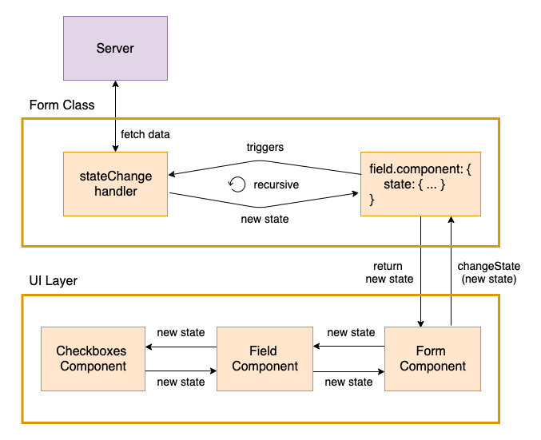

UI component for a field to use, such as DatePicker, Text, Number and and custom component.
Component can be editable (like `Checkboxes`) or readonly (like `Label`).
Each UI library can define a set of properties api which it will take data from the current form instance and 
inject it to its Field's components (properties like the component value, if its disabled, required and more).
For example, `@jafar/react-components` API is defined in [here](react-components.html).

## Field Component

To define field component - a component definition is required in the `model` object, and implementation is required in `resources` object.

### Model

`model.fields.someField.component` - object. Contains:

| Name          | Type          | Description |
| ------------- |-------------| ------------|
| name | required string | Represents a key in [resources.components](component#resources) object where actual UI components are defined |
| value | any | Represent the current formatted (if formatter exists) view value of the component. Auto generate by the Form lifecycle |
| state | object | Reflects the current component state data. | 

### Resources

`resources.components` - object. Required only if [model.fields.someField.component](component#model) defined in at least one of the fields.
Key is the component name and value is an `object` which contains:

| Name          | Type          | Description |
| ------------- |-------------| ------------|
| renderer | any | Actual UI component |
| stateChange | function | Triggers when state changes. Manage state changes outside of the ui component when using [stateless component](component#stateless-component). [More info](component#state-change)  |

### Example

```javascript
import InputText from '../my-components/InputText';
import Checkboxes from '../my-components/Checkboxes';

const model = {
  fields: {
    firstName: {
      // ...
      component: { 
        name: 'InputText',
        state: {
          placeholder: 'Enter name',
        },
      }
    },
    hobbies: {
      // ...
      component: { 
        name: 'SelectItems',
        state: {
          searchFilter: '',
          pageItems: [],
        },
      }
    }
  },
};

const resources = {
  components : { 
    InputText: {
      renderer: InputText, 
    },
    SelectItems: {
      renderer: Checkboxes,
      stateChange: () => {
        // do something and return new state
      },
    },
  },
};
```

Components can be one of: [stateful](component#stateful-component) or [stateless](component#stateless-component).

### Shorthand

Definition shorthand for component can be found in [definition shorthand documentation](definition-shorthand#components).

## Stateful Component

Stateful components save and manage their internal data inside them in a private location. When using stateful components the `state` definition object can be ignored or can be used only as the initial props of the component. Stateful components only notify Jafar about
value change, but not about state change (for example when search filter changes).


### Example

`employeeOfTheMonth` field uses statelful component `EntitySelect` which manage its internal state internally such as keeping current state (like search filter) and fetching data fom the server. It uses the `component.state` only as its initial props data:

```javascript
import EntitySelect from './components/EntitySelect';

const model = {
  fields: {
    // ...
    employeeOfTheMonth: {
      // ...
      component: {
       name: 'EntitySelect',
        state: {
          entityType: 'EMPLOYEE', 
        },
      },
    },
  },
};

const resource = {
  components: {
    EntitySelect: { 
      renderer: EntitySelect,
    },
  },
}
```

## Stateless component

Stateless components don't save / manage data internally. Their data is stored outside the component (in `component.state`). They suppose to be 'presentational' components - only render the data they get as props. They notify Jafar about both value and state change. When a state is changed in the component (for example user changed search items filter):
* UI Component (like Checkboxes) notifies UI Field Component about the change using `onStateChange` callback.
* UI Field Component notifies Form component.
* UI Form component (which uses internally `Form class` instance) calls - [form.changeState(fieldId, newState)](actions#changestate) action.
* Form instance updates `state` object.
* [stateChange](component#state-change) handler (which is responsible to manage changes for the state outside the component) Is triggered if exists (for example it can fetch new search items form the server) and return new state object (which triggers the `stateChange` handler to be called again - recursive loop until return no changes). 

Each `state` update - component re-renders with the new state.
The major con to use this approach is the ability to have a full form persistency (for example save the form model on a local storage after each form change, and when page refreshes - use the last saved form model from the local-storage to init the form again. This will render the ui at the exact place the user has it left it).



> **Note:** In your project, if a custom jafar component needs a non-strigify data, you can:
>  - Define a resourceId in the component state (i.e someField.component.state.resourceId = 'myExtraData').
>  - Define the resource under the resources object (i.e resources.myExtraData = () => {})
>  - Consume Jafar's context in the component, and get the resource from `context.resources[props.state.resourceId]`

#### Example

1. Email field uses stateless component `TextInput` with no stateChange.

```javascript
import TextInput from './components/TextInput';

const model = {
  fields: {
    // ...
    email: {
      // ...
      component: {
       name: 'TextInput',
        state: { 
          placeholder: 'Enter Email', 
        },
      },
    },
  }
};

const resources = {
  components: {
    TextInput: { renderer: TextInput },
  },
}
```

2. Users field uses stateless component `Checkboxes` which renders all the items as checkbox elements and a search input above, with an initial state. Component `Checkboxes` notifies Jafar when a search filter changes which triggers [stateChange](component#state-change) handler to
get new items and update the component state:

```javascript
import Checkboxes from '../myComponents/Checkboxes';

const model = {
  // ...
  fields: {
    users: {
      // ...
      component: {
        name: 'Checkboxes',
        state: { // initial state data that will be updated during lifecycle
          filter: '', 
          items: [], 
          isLoading: false
        },
      }
    }
  },
};

const resources = {
  components: {
    Checkboxes: { 
      renderer: Checkboxes,
      stateChange: (props) => {
        // do some calculations and return new state
      },
    },
  },
};
```

### State Change

`resources.components.someComponent.stateChange` - function. 

```javascript
function ({ 
  id, 
  value, // data value
  dependencies, // { id: { value (data value) } } 
  componentValue, // view value
  state, 
  prevValue, 
  prevDependencies, // { id: { value (data value) } }
  prevComponentValue, // view value
  prevState,
  context,
})
```

`Return value` is one of:
- `new state object` - which is set to `component.state`. In this case `stateChange` function is called again (recursive). 
- `undefined` - Lets the form know there are no more state changes needed. In that case `stateChange` function will not be called again.

> **Note:** `stateChange` can create recursive set states, so make sure to define a case that returns undefined result.


Define a state change handler when developing a stateless component (meaning keeping all the component's data outside of the component in the
`model.fields.someField.component.state` object instead of inside the ui component itself), and want to update the state object again after
the component called changeState and changed the `component.state` object. Manage the changes of the component outside the component - in jafar's handler is useful in terms that its not binded to any ui library implementation (such as `react` or `angular`). The same logic can be reused with different ui components libraries.

Function is called after field state or value changes (i.e form.changeValue or form.changeState actions are called) and returns state changes with updated data. Function can be sync / async (which resolves to the return value).

### Example

consider `users` field which uses `Checkboxes` component, which shows items according to data from the server (according to a filter), by defining a stateChange function that creates the calls to the server to get items, and propagates it to the `component.state` object - each time `component.state.filter` changes.

```javascript
import Checkboxes from '../myComponents/Checkboxes';
import UserService from '../services/UserService';

const model = {
  // ...
  fields: {
    users: {
      // ...
      component: {
        name: 'Checkboxes',
        state: { // initial state data that will be updated during lifecycle
          filter: '', 
          items: [], 
          isLoading: false
        },
      }
    }
  },
};

const resources = {
  components: {
    Checkboxes: { 
      renderer: Checkboxes,
      stateChange: async ({ state, prevState }) => {
        // if prevState not defined or filter changed
        // return item = [], and isLoading = true
        // to notify component to show loading wheel
        if (!prevState || prevState.filter !== state.filter) {
          return { ...state, items: [], isLoading: true };
        }

        // else if isLoading changed from falsy to true - do search and return 
        // new items + isLoading = false
        // to notify component to hide loading wheel and show page items
        if (state.isLoading) {
          const users = await UserService.search(state.filter);
          const items = allServerItems.map(user => ({ label: user.name, value: user.id }));
          return { ...state, items, isLoading: false };
        }

        // no more changes needed
        return undefined;
      },
    },
  },
};
``` 

Lets see the what happens when a user changes the search filter of the checkboxes items:

- Component notify the Field about the change using `onStateChange` callback, with the new state that includes the new search filter.
- Field component notifies Form component which calls `form.changeState` action with the new state.
- New `state` is saved to `component.state` (at this point component re-renders with the new state).
- `state` changed so `stateChange` handler *searchAsyncItems* is called.
- *searchAsyncItems* - identifies that filter has changed from the last state object, and change the state to `{ items: [], isLoading: true }`
- New `state` is saved to `component.state` (at this point component re-renders with the new state, and show loading wheel).
- `state` changed so `stateChange` handler *searchAsyncItems* is called.
- *searchAsyncItems* - identifies that loading has begun and calls the server to fetch new items. Return promise.
- Promise resolves to the new state `{ items, isLoading: false }`.
- New `state` is saved to `component.state` (at this point component re-renders with the new state, showing new items and hiding loading wheel).
- `state` changed so `stateChange` handler *searchAsyncItems* is called.
- *searchAsyncItems* - identifies no more changed needed - and return undefined to stop the loop.
