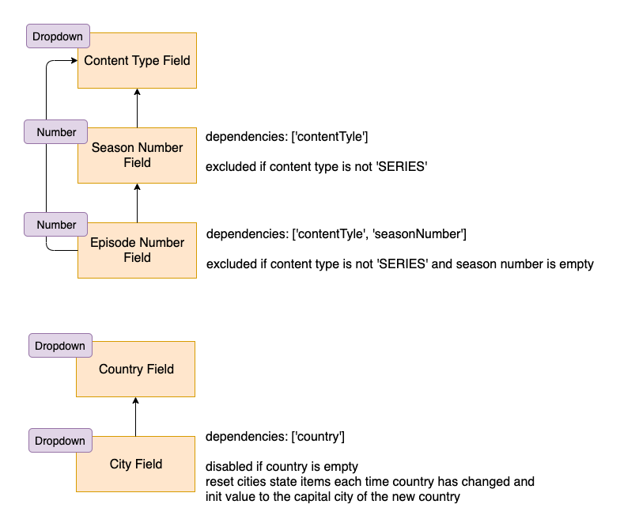

Define field dependencies to let Form lifecycle know a field depend on another field and will need to re-evaluate each time its dependencies 
value changes, as well as can change its own value / state after dependent field changes its value.

## Field Dependencies



### Model

`model.fields.someField.dependencies` - string array. Represent an array of fields ids that the current field is depended on at any time of the field's evaluation, such as - validators, excludeTerm, disableTerm and dependenciesChanges.
When the value of one of the dependencies changes, this field will be evaluated again (run excludeTerm, validators and disableTerm).

### Example

For a city field, that will be enabled only when country field is filled, then the city’s field dependencies are an array with the id of the country field:

```javascript
dependencies: ['country']
```

More details:
```javascript
import inputText from '../myComponents/Text';

const model = {
  // ...
  fields {
    country: {
      // ...
      component: {
        name: 'myTextInput'
      }
    },
    city: {
      // ...
      component: {
        name: 'myTextInput'
      },
      dependencies: ['country'],
      disableTerm: {
        operator: 'and',
        terms: [{
          name: 'countryEmpty',
        }],
      }
    }
  },
};

const resources = {
  components: {
    myTextInput: { renderer: inputText },
  },
  terms: {
    countryEmpty: { 
      func: props => props.dependencies.country.value !== '',
    },
  },
};
```