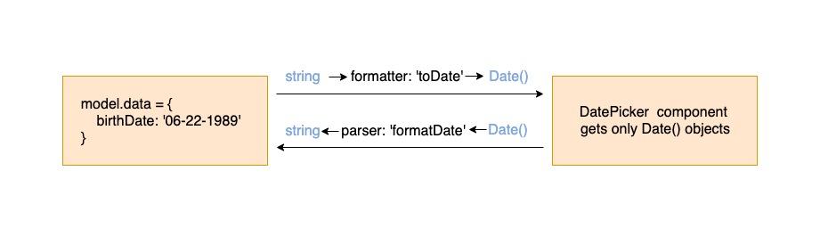

Define formatter and parser to a field component definition when the field's value structure is different then the structure that
the component can handle. 

For example - if a field 'birthDate' value is a string and its component of 'DatePicker' can only accept Date() objects. 



## Field Formatter Parser

To define field component formatter and parser - a definition is required in `model.fields.someField.component` object, and implementation is required in `resources.conversions` object.

> **Note:** Define both formatter and parser if the field uses editable component (i.e component calls change value), and only formatter if the field uses readonly component (i.e component doesn't call change value).

### Model

`model.fields.someField.formatter` and `model.fields.someField.parser`- object. Contains:

| Name          | Type          | Description |
| ------------- |-------------| ------------|
| name | required string | Represents the key in [resources.conversions](formatter-parser.html#resources) object |
| args | object | Custom data to pass to the conversion function |

### Resources

`resources.conversions` - object. Required only if [formatter](formatter-parser#model) or [parser](formatter-parser#model) defined in at least one of the fields.
Key is the conversion name, and value is an object that contains: 

| Name          | Type          | Description |
| ------------- |-------------| ------------|
| func | required function | Gets a value and return new value. Function can be `sync` or `async` function (that resolves to a new value). [More info](formatter-parser#func) | 
| defaultArgs | object | Default args for all fields. This will be shallow merged with field level conversion `args` before passed to the `func` | 

#### func

```
function ({ 
  id, 
  value, 
  state, 
  dependencies { id: { value } },
  args,
  context,
})
```

`return value` -
- When used by `formatter` - value is the `data value` (from model.data) and return value is the formatted value (view value for component).
- When used by `parser` - value is the `view value` (from component) and return value is the parsed value (data value).

### Example

consider `birthDate` field which uses `DatePicker` component, which accepts only Date() objects, but your model.data.birthDate is a string value that represent a date in the server. So, field `birthDate` should define: 
- A formatter function that gets the data value (string date) and return it as Date() object (then `DatePicker` component can accept it).
- A parser function that gets the view value (date object from the component) and return it as string (then it will be set back in the model.data).

```javascript
import DatePicker from '../myComponents/DatePicker';
import dateformat from 'dateformat';

const model = {
  fields: {
    birthDate: {
      // ...
      component: {
        name: 'DatePicker',
      },
      formatter: { name: 'toDate' },
      parser: { name: 'formatDate', args: { format: 'mm/dd/yyyy' } },
    }
  },
  data: {
    birthDate: '06/22/1989',
  }
};

// Note: both 'toDate' and 'formatDate' are built-in conversions and are not required here.
// We added them just for the example.
const resources = {
  components: {
    DatePicker: { 
      renderer: DatePicker 
    },
  },
  conversions: {
    toDate: {
      func: (props) => { // return Date()
        return new Date(props.value); // here 'props.value' is the data value (string) taken from model.data
      }
    },
    formatDate: {
      defaultArgs: { format: 'mm-dd-yyyy' }, // can be overridden by field level args
      func: (props) => { // return string
        return dateformat(props.value, props.args.format); // here 'props.value' is the view value (Date object) from the component
      }
    }
  }
};
```

### Shorthand

Definition shorthand for formatters / parsers can be found in [definition shorthand documentation](definition-shorthand#formatters-parsers).


## Built-in Conversions

Jafar also defines built-in conversions: `'toString', 'toNumber'` and so on. 
Built-in conversions work out of the box, there's no need to define them in `resources.conversions`.
Jafar extends custom `resources.conversions` object with the built-in conversions object.

Examples: 

1. Define `formatter` / `parser` conversion that is not part of the built-in conversions. In this case - conversions functions
should be supplied in `resources.conversions` object:

```javascript
const model = {
  // ...
  fields: {
    // ...
    birthDate: {
      // ...
      component :{
        // ...
      },
      formatter: { name: 'myFormatter' },
      parser: { name: 'myParser' },
    }
  },
};

const resources = {
  conversions = {
    myFormatter: {
      func: (props) => {
        // ...
      },
    },
    myParser: {
      defaultArgs: { // defaultArgs are not required
        // ...
      }
      func: (props) => {
        // ...
      },
    }
  }
}
```

2. Define `formatter` / `parser` conversion that is part of the built-in conversion. In this case there is not need to supply 
conversion in `resources.conversions` object:
 
```javascript
const model = {
  // ...
  fields: {
    // ...
    age: {
      // ...
      component :{
        // ...
      },
      formatter: { name: 'toNumber' },
      parser: { name: 'toString' },
    }
  },
  data: {
    age: '18', // as is string in the database
  }
};

// no need to define resources.conversions
```

3. Define `formatter` / `parser` conversion that is part of the built-in conversion and also define it in `resources.conversions` object in order to override the built-in function behavior (can override `func` / `args` / `both`):

```javascript
const model = {
  // ...
  fields: {
    // ...
    age: {
      // ...
      component :{
        // ...
      },
      formatter: { name: 'toNumber' },
      parser: { name: 'toString' },
    },
  },
  data: {
    age: '18', // as is string in the database
  }
};

const resources = {
  conversions: {
    toString: { // override the default build in conversion 'toString'. You can also supply defaultArgs or only supply defaultArgs
      func: props => { 
        // return ... 
      }
    }
  }
};
```

The following are Jafar's built-in conversions and their usage:

### toString

Convert `value` to string representation.

Expected value:

`string` / `number` / `boolean` / `Date()` / `null` / `undefined`

Returns:
- `string` - if value is `string` / `number` / `boolean` / `Date()`
- `undefined` - if value is `undefined`
- `null` - if value is `null`

Example:

Age field has a string representation in the model.data, but uses a component that only gets number values

```javascript
// model.fields.age
formatter: { name: 'toNumber' }
parser: { name: 'toString' }

// model.data
data: { age: '18' }
```

### toNumber

Convert `value` to number representation.

Expected value:

`string` / `number` / `boolean` / `Date()` / `null` / `undefined`

Returns:
- `number` - if value is `string` / `number` / `boolean` / `Date()`
- `undefined` - if value is `undefined`
- `null` - if value is `null`

Example:

Age field has a string representation in the model.data, but uses a component that only gets number values

```javascript
// model.fields.age
formatter: { name: 'toNumber' }
parser: { name: 'toString' }

// model.data
data: { age: '18' }
```

### toDate

Convert `value` to Date() representation.

Expected value:

`string` / `number` / `Date()` / `null` / `undefined`

Returns:
- `Date()` - if value is `string` / `number` / `Date()`
- `undefined` - if value is `undefined`
- `null` - if value is `null`

Example:

Birthdate field has a number representation in the model.data, but uses a component that only gets date values

```javascript
// model.fields.birthDate
formatter: { name: 'toDate' }
parser: { name: 'toNumber' }

// model.data
data: { birthDate: 1575715837659 }
```

### toBoolean

Convert `value` to boolean representation.

Expected value:

`string` / `number` / `boolean` / `null` / `undefined`

Returns:
- `boolean` - if value is `string` / `number` / `boolean` / `null` / `undefined`

Example:

CanViewVideo field has a string representation in the model.data, but uses a component that only gets boolean values

```javascript
// model.fields.canViewVideo
formatter: { name: 'toBoolean' }
parser: { name: 'toString' }

// model.data
data: { canViewVideo: 'true' }
```

### formatDate

Convert `value` to formatted date string.

Expected value:

`Date()` / `null` / `undefined`

Returns:
- `string` - if value is Date() `object`
- `undefined` - if value is `undefined`
- `null` - if value is `null`

Default args:

| Name          | Type          | Default | Description |
| ------------- |-------------|------------|------------|
| format | string | 'mm-dd-yyyy'  | Format of a date in a string representation |


Example:

Birthdate field has a string representation in the model.data, but uses a component that only gets Date() values

```javascript
// model.fields.birthDate
formatter: { name: 'toDate' }
parser: { name: 'formatDate', args: { format: 'mm/dd/yyyy' } }

// model.data
data: { birthDate: '06/22/1989' }
```

### split

Convert `value` to array representation containing split parts of `value`.

Expected value:

`string` / `null` / `undefined`

Returns:
- `string array` - if value is `string`
- `undefined` - if value is `undefined`
- `null` - if value is `null`

Default args:

| Name          | Type          | Default | Description |
| ------------- |-------------|------------|------------|
| separator | string | ','  | Separates value using this |

Example:

Friends field has a string representation in the model.data, but uses a component that only gets array values

```javascript
// model.fields.friends
formatter: { name: 'split', args: { separator: ';' } } // default separator is ','
parser: { name: 'join', args: { separator: ';' } }

// model.data
data: { friends: 'Rachel;Ross;Monica' }

// split will return ['Rachel', 'Ross', 'Monica']
```

### join

Convert `value` to string representation containing joined parts of `value`.

Expected value:

`array` / `null` / `undefined`

Returns:
- `string` - if value is `array`
- `undefined` - if value is `undefined`
- `null` - if value is `null`

Default args:

| Name          | Type          | Default | Description |
| ------------- |-------------|------------|------------|
| separator | string | ','  | Join value using this |
| path | string | undefined  | If array is array of objects - define a path to the sub data to join for each object in the array |

Example:

1. Friends field has a string representation in the model.data, but uses a component that only gets array values

```javascript
// model.fields.friends
formatter: { name: 'split', args: { separator: ';' } } // default separator is ','
parser: { name: 'join', args: { separator: ';' } }

// model.data
data: { friends: 'Rachel;Ross;Monica' }

// split will return ['Rachel', 'Ross', 'Monica']
```

2. Friends field has an objects array representation in the model.data, but uses a component that only gets string value

```javascript
// model.fields.friends
formatter: { name: 'join', args: { path: 'name', separator: ', ' } }

// model.data
data: { 
  friends: [
    { name: 'Rachel'}, 
    { name: 'Monica' }, 
    { name: 'Ross' }
  ]; 
}

// join will return 'Rachel, Monica, Ross'
```

### joinKeys

Convert keys of `value` to string representation containing joined parts of `value`'s keys.

Expected value:

`object` / `null` / `undefined`

Returns:
- `string` - if value is `object`
- `undefined` - if value is `undefined`
- `null` - if value is `null`

Default args:

| Name          | Type          | Default | Description |
| ------------- |-------------|------------|------------|
| separator | string | ','  | Join value using this |


Example:

Colors field has an object representation in the model.data, but uses a component that only gets string

```javascript
// model.fields.colors
formatter: { name: 'joinKeys', args: { separator: ', ' } } // default separator is ','

// model.data
data: { 
  colors: { 
    RED: 'Red', 
    BLUE: 'Blue', 
    GREEN: 'Green' 
  } 
}

// joinKeys will return 'RED, BLUE, GREEN'
```

### joinValues

Convert values of `value` to string representation containing joined parts of `value`'s values.

Expected value:

`object` / `null` / `undefined`

Returns:
- `string` - if value is `object`
- `undefined` - if value is `undefined`
- `null` - if value is `null`

Default args: 

| Name          | Type          | Default | Description |
| ------------- |-------------|------------|------------|
| separator | string | ','  | Join value using this |
| path | string | undefined  | Define a path to the sub data to join each object in the object values |


Example:

1. Colors field has an object representation in the model.data, but uses a component that only gets string

```javascript
// model.fields.colors
formatter: { name: 'joinValues', args: { separator: ', ' } } // default separator is ','

// model.data
data: { 
  colors: { 
    RED: 'Red', 
    BLUE: 'Blue', 
    GREEN: 'Green' 
  } 
}

// joinValues will return 'Red, Blue, Green'
```

2. Colors field has an object representation in the model.data, but uses a component that only gets string

```javascript
// model.fields.colors
formatter: { name: 'joinValues', args: { separator: ', ', path: 'label' } } // default separator is ','

// model.data
data: { 
  colors: { 
    RED: { label: 'Red' }, 
    BLUE: { label: 'Blue' }, 
    GREEN: { label: 'Green' }
  }
}

// joinValues will return 'Red, Blue, Green'
```

### jsonStringify

Convert `value` to json string representation.

Expected value:

`any` / `undefined`

Returns:
- `undefined` - if value is `undefined`
- `string` - if value is `any`

Example:

CustomDate field has a string representation in the model.data, but uses a json editor component that only gets object values

```javascript
// model.fields.customDate
formatter: { name: 'jsonParse' }
parser: { name: 'jsonStringify' }

// model.data
data: { 
  customData: '{"name":"Rachel","age":25}'
}

// jsonParse will return { 
//     name: "Rachel", 
//     age: 25, 
//   }
```

### jsonParse

Convert `value` to object.

Expected value:

`string` / `null` / `undefined`

Returns:
- `object` - if value is stringified `string`
- `undefined` - if value is `undefined`
- `null` - if value is `null`

Example:

CustomDate field has a string representation in the model.data, but uses a json editor component that only gets object values

```javascript
// model.fields.customDate
formatter: { name: 'jsonParse' }
parser: { name: 'jsonStringify' }

// model.data
data: { 
  customData: '{"name":"Rachel","age":25}'
}

// jsonParse will return { 
//     name: "Rachel", 
//     age: 25, 
//   }
```