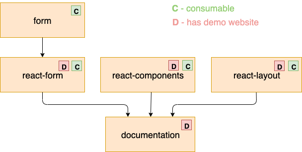

Jafar is built as a monorepo which includes the following packages:

## Main Packages Structure



### @jafar/form
[@jafar/form](https://github.com/yahoo/jafar/tree/master/packages/form) - contains a javascript form class, that can also server as a base form utility to any UI library (such as React, Angular and Vue).

Usage Example:

```javascript
import Form from '@jafar/form';

it('should update the form data on change field value ', async () => {
  const model = {
    id: 'simple',
    data: {},
    fields: {
      name: {
        path: 'name',
      },
      lastName: {
        path: 'lastName',
      },
    },
  };

  const form = new Form();
  await form.init(model);
  expect(form.data).toEqual({});
  await form.changeFieldValue('Rachel', 'name');
  expect(form.data).toEqual({
    name: 'Rachel',
  });
});
```

### @jafar/react-form
[@jafar/react-form](https://github.com/yahoo/jafar/tree/master/packages/react-form) - contains React [Form and Field](https://yahoo.github.io/jafar/demo-react-form.html) components. Based on `@jafar/form`. 

Usage Example: 

```javascript
import { Form, Field } from '@jafar/react-form';

const model = {...};

<Form model={model}>
  <h2>User Details</h2>
  <Field id="firstName" />
  <Field id="lastName" />
</Form>
```

### @jafar/react-components
[@jafar/react-components](https://github.com/yahoo/jafar/tree/master/packages/react-components) - contains common [unified api components](https://yahoo.github.io/jafar/demo-react-components.html) for form usage. Exports common components that can be added to forms.

Usage Example:
```javascript
import TextInput from '@jafar/react-components/edit/Text';

const model = {
  // ...
  fields {
    email: {
      // ...
      component: {
        name: 'myTextInput'
      }
    }
  },
};

const resources = {
  components: {
    myTextInput: { renderer: TextInput },
  }
}
```

### @jafar/react-layout
[@jafar/react-layout](https://github.com/yahoo/jafar/tree/master/packages/react-layout) - contains React Layout components
such as [Item and List](https://yahoo.github.io/jafar/demo-react-layout.html).

Usage Example: 

```javascript
import Item from '@jafar/react-layout/Item';

const item = {
  title: 'Edit User',
  sections: [...],
  mainActions: [...],
  optionsActions: [...],
};

<Item item={...item} />
```

### @jafar/react-editor
[@jafar/react-editor](https://github.com/yahoo/jafar/tree/master/packages/react-editor) - contains form and layout configurations [editor](https://yahoo.github.io/jafar/demo-react-editor.html). 

### @jafar/documentation
[@jafar/documentation](https://github.com/yahoo/jafar/tree/master/packages/documentation) - contains [this documentation site](https://yahoo.github.io/jafar/).