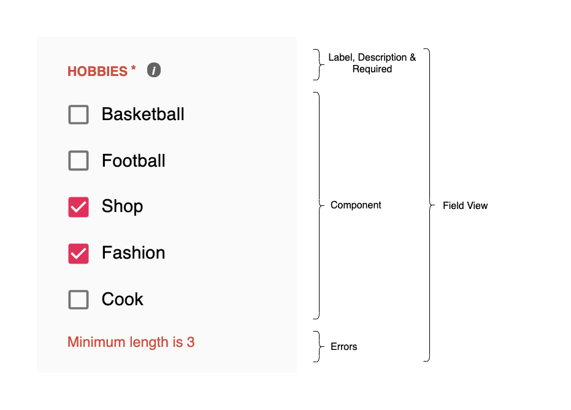

Field component is a specific child component that uses the Form's context to get data from the form and change 
the form data.

## Field Component

`@jafar-org/react-form/Field` serves as a default field component. Its the result of `withContext(SomeFieldView)` hoc (that pass the underline field view component all the data that the field view needs to render) and a default `FieldView` component:

```javascript
import withContext from './field-with-context';
import FieldView from './FieldView';

export default withContext(FieldView);
```

### Props

| Name          | Type          | Description |
| ------------- |-------------| ------------|
| id         | required string | Field id as represented in the json of `model.fields` object keys |


> **Note:** Field component propagates every property to the component it wraps, except for jafar-reserved properties, that appear in
[Field View](react-field.html#field-view). However, specifying the property outside of Jafar's context also means it is not part of the lifeycycle of Jafar any more. Therefore, we strongly recommend to use Jafar Form configuration `field.component.state` object to pass data for each underline component.

### Usage Example

```javascript
import { Form, Field } from '@jafar-org/react-form';
import SomeInputText from './my-components/Text.jsx';

const model = {
  id: 'user-form',
  fields: {
    firstName: {
      path: 'firstName',
      label: 'First Name',
      component: {
        name: 'InputText',
      },
    },
    lastName: {
      path: 'lastName',
      label: 'Last Name',
      component: {
        name: 'InputText',
      },
    }
  }
};

const resources = {
  components: {
    InputText: : { renderer: SomeInputText },
  }
};

<Form model={model} resources={resources}>
  <h2>User Details</h2>
  <Field id="firstName" />
  <Field id="lastName" />
</Form>
```

### Structure


## withContext(FieldView) HOC

A function that gets a FieldView component as a parameter and returns a new wrapped component, which receives data from the closest Form Provider's context using the `id` prop, and populates props for the FormView from its form's `context.model.fields[id]`.

## Field View

Renders the specified component (for instance, inputText, checkboxList, etc) and some metadata like label, description and errors. Jafar provides a default FieldView but
any app can design its own field view and use it like `const Field = withContext(MyCustomFieldView`;

#### Note

The fields in `model.fields` represent the form. Each field defines a settings that will affect its lifecycle. If you choose NOT to include a specific field in the render function - the field's lifecycle is still evaluated (meaning that excludeTerm, validations and disableTerm are evaluated nonetheless). 
Keep in mind that all fields are evaluated even without being rendered.

### Props

| Name          | Type          | Description |
| ------------- |-------------| ------------|
| id | required string | Field id |
| label | string | Field label |
| description | string | Field info |
| component | function / class | function. React ui component which manipulates the field value. Component should get a set of predefined props as described in [Unified api components](react-components.html) |
| value | any | Value of the field, supplied from the `model.data` |
| state | object | Represents the ui state of the field's component |
| excluded| boolean | Is the field excluded? (and not rendered) |
| disabled | boolean | Is the field disabled? |
| dirty | boolean | Is the field value not equals to its initial value? |
| required | boolean | Is the field required to have a valid value? |
| empty | boolean | Is the field value considered empty? (according to [isEmpty](hooks#isempty) function) |
| invalid | boolean | Is the field invalid? (if a field is required and empty - and have required error, its not considered invalid in terms of UX |
| errors | object array | Current field errors - array of { name, message } |
| onValueChange | function | Callback to pass new value for the field |
| onStateChange | function | Callback to pass new component state for the field |

### Our Field View

For the following form definition:

```javascript
import CheckboxCollection from '@jafar-org/react-components/edit/CheckboxCollection';

const form = {
  id: 'user-form',
  fields: {
    hobbies: {
      label: 'Hobbies',
      path: 'hobbies',
      description: 'Select at least 3 hobbies',
      component: {
        name: 'CheckboxCollection',
        state: {
          items: [
            { label: 'Basketball', value: 'BASKETBALL'},
            { label: 'Football', value: 'FOOTBALL'},
            { label: 'Shop', value: 'SHOP'},
            { label: 'Fashion', value: 'FASHION'},
            { label: 'Cook', value: 'COOK'},
          ]
        },
      },
      required: true,
      validators: [{
        name: 'minLength',
        args: {
          value: 3,
        }
      }]
    },
  },
  data: {
    hobbies: ['SHOP', 'FASHION'],
  }
};

const resources = {
  components: {
    CheckboxCollection: { renderer: CheckboxCollection },
  }
}
```

FieldView will render:



### Custom Field View

Defined a custom FieldView component. Define a brand new component, or extend the default FieldView component, and override just some of the render functions.

> **Note:** in our default [FieldView](react-field) exposed component we implemented `shouldComponentUpdate` to avoid unnecessary field renders. You should use the same approach in a custom field view. Another short option will be to extend our default [FieldView](react-field) and override only the `render`
function or some of `getHeader`, `getBody` and `getFooter` class functions.

Example
```javascript
import CheckboxCollection from '@jafar-org/react-components/edit/CheckboxCollection';
import Text from '@jafar-org/react-components/edit/Text';
import { Form, withContext} from '@jafar-org/react-form';
import CustomFieldView from '../views/CustomFieldView';

// create field with custom field view
const Field = withContext(CustomFieldView);

const form = {
  id: 'user-form',
  fields: {
    name: {
      path: 'name',
      label: 'Name',
      description: 'Enter user name',
      component: {
        name: 'Text',
      },
      required: true,
    },
    hobbies: {
      label: 'Hobbies',
      path: 'hobbies',
      description: 'Select user hobbies',
      component: {
        name: 'CheckboxCollection',
        state: {
          items: [
            { label: 'Basketball', value: 'BASKETBALL'},
            { label: 'Football', value: 'FOOTBALL'},
            { label: 'Shop', value: 'SHOP'},
            { label: 'Fashion', value: 'FASHION'},
            { label: 'Cook', value: 'COOK'},
          ]
        },
      },
    },
  },
  data: {
    hobbies: ['SHOP', 'FASHION'],
  }
};

const resources = {
  components: {
    CheckboxCollection: { renderer: CheckboxCollection },
    Text: { renderer: Text },
  }
}

<Form model={model} resources={resources}>
  <Field id="name" />
  <Field id="hobbies" />
</Form>
```

Example


You have more detailed example in our [form demos](form-demos.html)