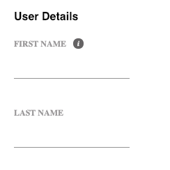

React form exposes Form and Field components to be used in an app, allowing developers to easily define a form definition (model & resources) that will list all
the form settings (such as validations, disable term, field dependencies and more) and lifecycle hooks (such as before and after actions, submit, form level validations and dto conversions). In addition, Form component exposes a context that include both current form model, resources and actions to perform on the form. That context can be used within any child component of the Form component (not necessary direct child component). Field component is a specific child component that uses the Form's context to get data from the model and call actions to change the form model.

Its based on Jafar [Form Class](form-overview.html), so all form definitions and actions are documented there. 
React form is only an UI layer for the user to integrate with the underline Form class. The entire form lifecycle is managed in the Form class, and react-form only calls the Form class api to integrate and manipulate the form according to the user interactions, and exposes to the Form's underline components the updated data of the form.

## Structure


## Form UI renders

Any action of Form class is a process that can update the Form instance internal store several times. Only when an update is relevant to UI components (such as component view value change, component state change and form processing change) will the Form component get an `updated form` from the Form class - causing the underline components to re-render several (necessary) times. These updated are relevant to the ui to be notified. 

For example when calling submit action - `model.processing` turns to true (causing the UI to update), executing submit action and then updating `model.processing` to false (causing the UI to update again). While `model.processing` is true - the save button can be disabled if `model.processing`, verifying submit was
not clicked when the form is already processing.

In our exposed [Field](react-field) component - which is a specific underline component to a Form, we implemented `shouldComponentUpdate` (in the [FieldView](react-field#field-view)) to avoid unnecessary field renders. You may use the same approach for other custom Form underline component - if needed.

## High level overview

### Form definition object

The following is a simple form definition example:

```javascript
import someInputText from './my-components/Text.jsx';

const model = {
  id: 'userForm',
  fields: {
    firstName: {
      path: 'firstName',
      label: 'First Name',
      description: 'Enter user first name',
      component: {
        name: 'text',
      },
    },
    lastName: {
      path: 'lastName',
      label: 'Last Name',
      component: {
        name: 'text',
      },
    }
  },
};

const resources = {
  components: {
    text: { renderer: someInputText },
  }
};
```

### Form & Field UI components

After defining the form model and resources objects, define the Form and Field components in your JSX, and pass the model and resources to the Form component:

```jsx
import { Form, Field } from '@jafar/react-form';

<Form model={model} resources={resources}>
  <h2>User Details</h2>
  <Field id="firstName" />
  <Field id="lastName" />
</Form>
```

### Result

 